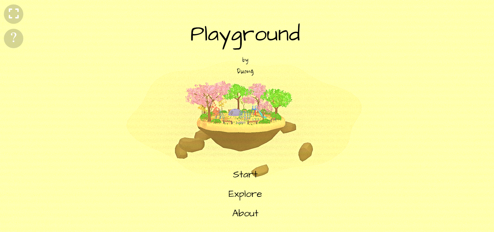

# Playground

## Overview

Welcome to my repository! This project is a platform for creating interactive 3D scenes by combining the power of Blender and Three.js. Whether you are a 3D artist, a web developer, or someone interested in exploring the capabilities of Blender and Three.js, this playground provides a creative space for experimentation and collaboration.

## Features

- **Blender Integration**: Leverage the power of Blender to create and export 3D models for use in the playground.
- **Three.js Rendering**: Utilize the capabilities of Three.js for rendering and interacting with 3D content in the web browser.
- **Interactive Environment**: Experiment with different materials, lighting, and camera setups to create visually stunning 3D scenes.
- **Easy Setup**: Follow the simple setup instructions below to get the playground up and running quickly.

## Demo

Check out our live demo [here](https://playground-threejs.netlify.app/)




## Usage

To get started with the Blender and Three.js Playground, follow these steps:

1. **Clone the Repository:**
   ```
   git clone https://github.com/duongve13112002/playground_threejs.git
   cd playground_threejs/project
   ```

2. **Install Dependencies:**
   ```
   npm install
   ```

3. **Run the Development Server:**
   ```
   npm run dev
   ```

4. **Open the Playground:**
   Open your web browser and navigate to `http://localhost:8000`.


## Contributing

Contributions are welcome! If you have ideas for new features, improvements, or bug fixes, please open an issue or submit a pull request.

## License

This project is licensed under the MIT License - see the [LICENSE](LICENSE) file for details.

## Acknowledgments

- The Blender and Three.js communities for providing powerful tools and resources.
- [Three.js](https://threejs.org/) - A lightweight and efficient 3D library.
- [Blender](https://www.blender.org/) - An open-source 3D creation suite.


Happy 3D coding! 🚀
